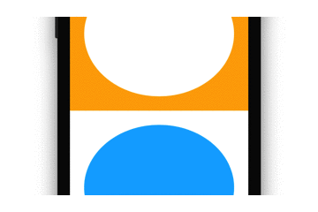

# ShapeLayerView

CAShapeLayer-backed UIView subclass that synchronizes with UIKit-internal animations, e.g. orientation change.

### Before

### After

## How it work

- [Hacking UIView animation blocks for fun and profit](https://gist.github.com/nicklockwood/d374033b27c62662ac8d) by @nicklockwood
